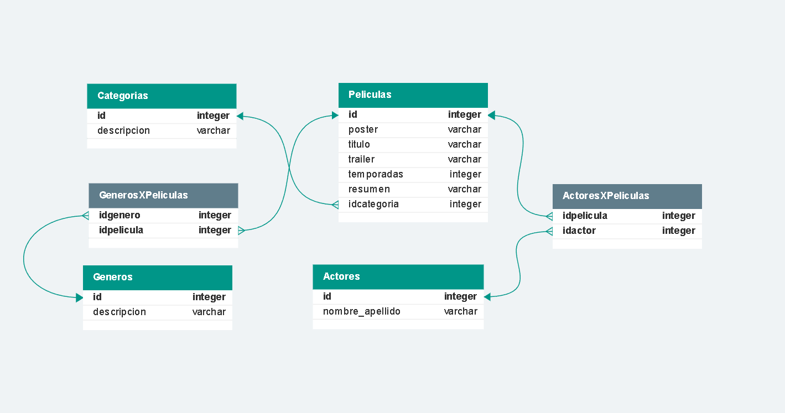

<h1>API REST TRAILERFLIX</h1>
<p>Proyecto final Argentina Programa 4.0 tramo 2</p>

<!--  -->


<h2> Introducción</h2>
Esta documentación te guiará a realizar diferentes consultas hacia la API.

</br>

- [Instalación](#instalación)
  - [Base de datos](#base-de-datos)
  - [.env](#env)
  - [Dependencias:](#dependencias)
  - [EJS](#ejs)
- [Rutas Catalogo](#rutas-catalogo)
- [Rutas Categorias](#rutas-categorias)
- [Rutas Generos](#rutas-generos)
- [Ejemplos de uso](#ejemplos-de-uso)
  - [GET contenidos](#get-contenidos)
  - [GET contenido por ID](#get-contenido-por-id)
  - [GET contenido por Nombre](#get-contenido-por-nombre)
  - [GET contenidos por Categoria](#get-contenidos-por-categoria)
  - [POST de Categoria](#post-de-categoria)
  - [DELETE de generos](#delete-de-generos)


# Instalación

## Base de datos
En MySQL ejecuta el archivo **trailerflix_db.sql** que se encuentra en la carpeta **config**


## .env
Deberás crear en tu carpeta raíz un archivo de conexion a tu base de datos con nombre **".env"** donde incluirás las siguientes variables con tu informacion local:
```javascript
DB_SCHEMA = "trailerflix"
DB_USER = "root"
DB_PASSWORD = "root"
DB_HOST = "localhost"
```

## Dependencias:
Asumiendo que tiene node.js preinstalado, asegurese de que su terminal este posicionada en la carpeta raiz del proyecto y ejecute  el siguiente comando para instalar todas las dependencias necesarias:
```
npm install
```

Ahora ya puedes comenzar a ejecutar el programa con el siguiente comando:
```
npm start
```
Comienza a realizar peticiones desde Thunder Client, Postman, u otra alternativa


## EJS
Opcionalmente puedes visualizar el proyecto desde el navegador a traves de la URL base http://localhost:3000


<br>

# Rutas Catalogo
|MÉTODO|URL|DESCRIPCION|
|-|-|-|
|GET|http://localhost:3000/|La URL o ruta principal
|GET| http://localhost:3000/api/catalogo | La URL general para visualizar todo el catalogo
|GET| http://localhost:3000/api/catalogo/:id | La URL para visualizar un contenido por su código
|GET| http://localhost:3000/api/catalogo/nombre/:nombre | La URL para visualizar un contenido/s por su nombre o parte de él
|GET| http://localhost:3000/api/catalogo/categoria/:categoria | La URL para visualizar contenidos por una categoria
|GET| http://localhost:3000/api/catalogo/genero/:genero | La URL para visualizar contenidos por un genero

<br>

# Rutas Categorias
|MÉTODO|URL|DESCRIPCION|
|-|-|-|
|GET| http://localhost:3000/categorias | La URL que nos permite visualizar todas las categorias
|POST| http://localhost:3000/categorias | La URL que nos permite dar de alta una categoria
|DELETE| http://localhost:3000/categorias/:id | La URL que nos permite eliminar una categoria por su ID

<br>

# Rutas Generos
|MÉTODO|URL|DESCRIPCION|
|-|-|-|
|GET| http://localhost:3000/generos | La URL que nos permite visualizar todos los generos
|POST| http://localhost:3000/generos | La URL que nos permite dar de alta un genero
|DELETE| http://localhost:3000/generos/:id | La URL que nos permite eliminar un genero por su ID

<br>

# Ejemplos de uso
## GET contenidos
Todas las consultas de tipo GET retornarán un formato JSON.

La URL general para visualizar todos los contenidos.
```py
http://localhost:3000/api/catalogo
```

```json
{
   "id":1,
   "poster":"http://localhost:3000/img/posters/1.jpg",
   "resumen":"Este drama narra las rivalidades politicas y el romance de la reina Isabel II, asi como los sucesos que moldearon la segunda mitad del siglo XX.",
   "temporadas":4,
   "titulo":"The Crown",
   "trailer":null,
   "categoria":"Serie",
   "generos":"Drama, Hechos veridicos",
   "actores":"Claire Foy, Olivia Colman, Matt Smith, Tobias Menzies, Vanessa Kirby, Helena Bonham Carter"
},
{
   "id":2,
   "poster":"http://localhost:3000/img/posters/2.jpg",
   "resumen":"El paso a la edad adulta incluye sexo, romance, escuela y familia. Para Archie y sus amigos, tambien hay misterios oscuros.",
   "temporadas":5,
   "titulo":"Riverdale",
   "trailer":null,
   "categoria":"Serie",
   "generos":"Drama, Ficcion, Misterio",
   "actores":"Lili Reinhart, Casey Cott, Camila Mendes, Marisol Nichols, Madelaine Petsch, Madchen Amick"
}
```

## GET contenido por ID
La URL general para visualizar un contenido por su id
```py
http://localhost:3000/api/catalogo/2 
```
```json
{
   "id":2,
   "poster":"http://localhost:3000/img/posters/2.jpg",
   "resumen":"El paso a la edad adulta incluye sexo, romance, escuela y familia. Para Archie y sus amigos, tambien hay misterios oscuros.",
   "temporadas":5,
   "titulo":"Riverdale",
   "trailer":null,
   "categoria":"Serie",
   "generos":"Drama, Ficcion, Misterio",
   "actores":"Lili Reinhart, Casey Cott, Camila Mendes, Marisol Nichols, Madelaine Petsch, Madchen Amick"
}
```


## GET contenido por Nombre
La URL que nos retorna un contenido/s por su nombre o parte de él.
```py
http://localhost:3000/api/catalogo/nombre/Riverdale
```
```json
{
   "id":2,
   "poster":"http://localhost:3000/img/posters/2.jpg",
   "resumen":"El paso a la edad adulta incluye sexo, romance, escuela y familia. Para Archie y sus amigos, tambien hay misterios oscuros.",
   "temporadas":5,
   "titulo":"Riverdale",
   "trailer":null,
   "categoria":"Serie",
   "generos":"Drama, Ficcion, Misterio",
   "actores":"Lili Reinhart, Casey Cott, Camila Mendes, Marisol Nichols, Madelaine Petsch, Madchen Amick"
}
```


## GET contenidos por Categoria
La URL que nos retorna un contenido/s por su categoria.
```py
http://localhost:3000/api/catalogo/categoria/serie
```

```json
{
   "id":2,
   "poster":"http://localhost:3000/img/posters/2.jpg",
   "resumen":"El paso a la edad adulta incluye sexo, romance, escuela y familia. Para Archie y sus amigos, tambien hay misterios oscuros.",
   "temporadas":5,
   "titulo":"Riverdale",
   "trailer":null,
   "categoria":"Serie",
   "generos":"Drama, Ficcion, Misterio",
   "actores":"Lili Reinhart, Casey Cott, Camila Mendes, Marisol Nichols, Madelaine Petsch, Madchen Amick"
}
```


## POST de Categoria
La URL que nos permite dar de alta un recurso.
Deberás enviar en el cuerpo (body) de la solicitud un documento en formato JSON.
De resultar exitosa la operación, se retornará como respuesta el mismo documento.

http://localhost:3000/categorias/

Body:
```json
  {
    "descripcion": "Musical"
  }
```
Response:
```json
  {
    "id": 3,  
    "descripcion": "Musical"
  }
```

## DELETE de generos
La URL que nos permite eliminar un recurso existente
```py
http://localhost:3000/generos/20
```
Response:
```json
  {
    "mensaje": "Genero eliminado con éxito"
  }
```
